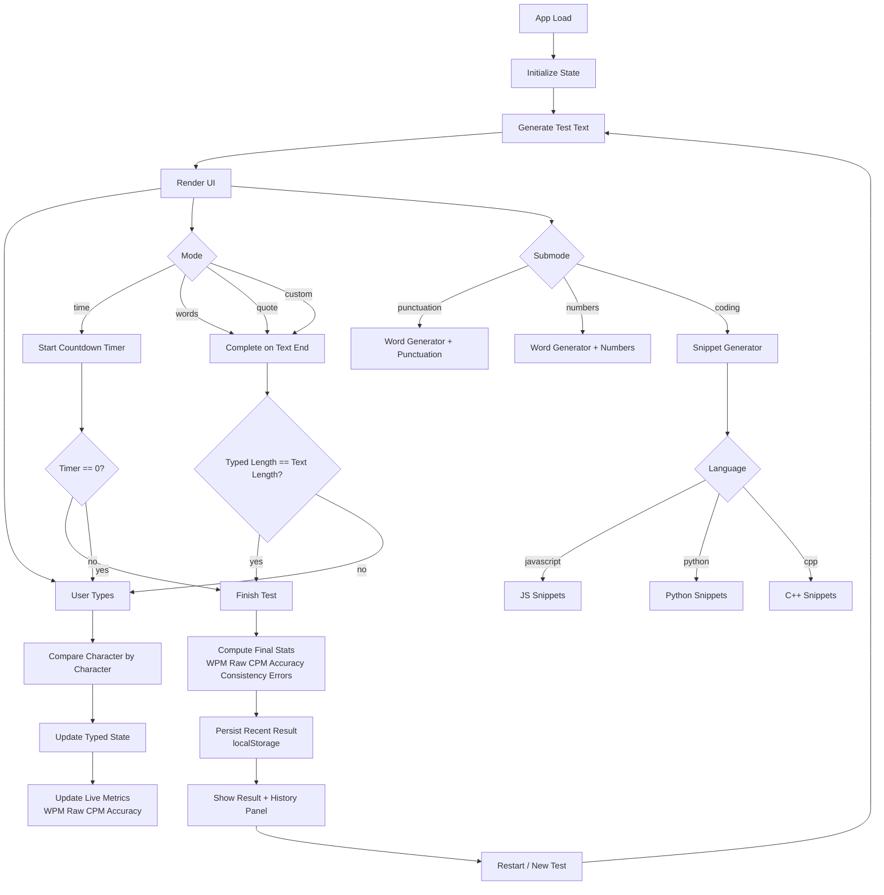

# LetsType Frontend Flowchart

```mermaid
flowchart TD
  A[App Load] --> B[Initialize State]
  B --> C[Generate Test Text]
  C --> D[Render UI]

  D --> E[User Types]
  E --> F[Compare Character by Character]
  F --> G[Update Typed State]
  G --> H[Update Live Metrics<br/>WPM Raw CPM Accuracy]

  D --> I{Mode}
  I -->|time| J[Start Countdown Timer]
  I -->|words| K[Complete on Text End]
  I -->|quote| K
  I -->|custom| K

  D --> L{Submode}
  L -->|punctuation| M[Word Generator + Punctuation]
  L -->|numbers| N[Word Generator + Numbers]
  L -->|coding| O[Snippet Generator]
  O --> P{Language}
  P -->|javascript| Q[JS Snippets]
  P -->|python| R[Python Snippets]
  P -->|cpp| S[C++ Snippets]

  J --> T{Timer == 0?}
  T -->|yes| U[Finish Test]
  T -->|no| E

  K --> V{Typed Length == Text Length?}
  V -->|yes| U
  V -->|no| E

  U --> W[Compute Final Stats<br/>WPM Raw CPM Accuracy Consistency Errors]
  W --> X[Persist Recent Result<br/>localStorage]
  X --> Y[Show Result + History Panel]
  Y --> Z[Restart / New Test]
  Z --> C
```
